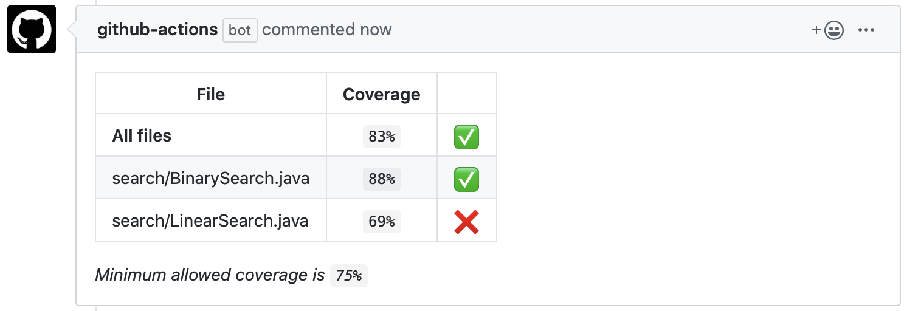
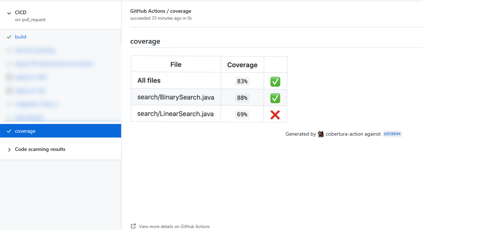

# Cobertura action


GitHub Action which parse a [XML cobertura report](http://cobertura.github.io/cobertura/) and display the metrics in a GitHub Pull Request.

Many coverage tools can be configured to output cobertura reports:

* [coverage.py](https://coverage.readthedocs.io/en/latest/cmd.html#xml-reporting)
* [Istanbul](https://istanbul.js.org/docs/advanced/alternative-reporters/#cobertura)
* [Maven](https://www.mojohaus.org/cobertura-maven-plugin/)
* [simplecov](https://github.com/colszowka/simplecov/blob/master/doc/alternate-formatters.md#simplecov-cobertura)

This action will not currently work when triggered by pull requests from forks, like is common in open source projects.
This is because the token for forked pull request workflows does not have write permissions on the target repository.
Hopefully GitHub will have a solution for this in the future. In the meantime one can use utilize multiple workflows and
artifacts to circumvent this. See the workflows in this project for an implementation example and this blog post https://securitylab.github.com/research/github-actions-preventing-pwn-requests.


## How it looks like

A comment is added to the pull request with the coverage report.



A check is added to the workflow run.



The check will succeed or fail based on your threshold when `fail_below_threshold` is set to `true`, this allows you to mandate coverage checks pass on your [protected branches](https://docs.github.com/en/github/administering-a-repository/defining-the-mergeability-of-pull-requests/about-protected-branches).

## Inputs

### `repo_token`

The GITHUB_TOKEN. Defaults to `${{github.token}}`

### `path`

The path to the cobertura report. Defaults to `coverage.xml`. Glob pattern is supported, for example `coverage/*.xml`.

## `prefix_path`

This prefix is added to every `filename` within the cobertura report. This can resolve issues with `link_missing_lines` URLs and `only_changed_files`.

### `skip_covered`

If files with 100% coverage should be ignored. Defaults to `true`.

### `minimum_coverage`

The minimum allowed coverage percentage as an integer.

### `fail_below_threshold`

Fail the action when the minimum coverage was not met.

### `show_line`

Show line rate as specific column.

### `show_branch`

Show branch rate as specific column.

### `show_class_names`

Show class names instead of file names.

### `show_missing`

Show line numbers of statements, per module, that weren't executed.

### `show_missing_max_length`

Crop missing line numbers strings that exceeds this length, provided as an integer.

Default is no crop.

(Note: "&hellip;" is appended to a cropped string)

### `link_missing_lines`

Link missing line numbers. This only has an effect when `show_missing` is set to `true`.
Defaults to `false`.

### `only_changed_files`

Only show coverage for changed files.

### `report_name`

Use a unique name for the report and comment.

### `pull_request_number` **Optional**

Pull request number associated with the report. This property should be used when workflow trigger is different than `pull_request`.

If no pull request can determine the action will skip adding the comment.

## Example usage

```yaml
on:
  pull_request:
    types: [opened]
    branches:
      - master
jobs:
  coverage:
    runs-on: ubuntu-latest
    steps:
      - uses: 5monkeys/cobertura-action@master
        with:
          path: src/test.xml
          minimum_coverage: 75
```

## Development

- Install deps: `npm ci`
- Run tests: `npm run test`
- Run lint: `npm run lint`
- Package application `npm run package`. Remember to run this before committing anything.
